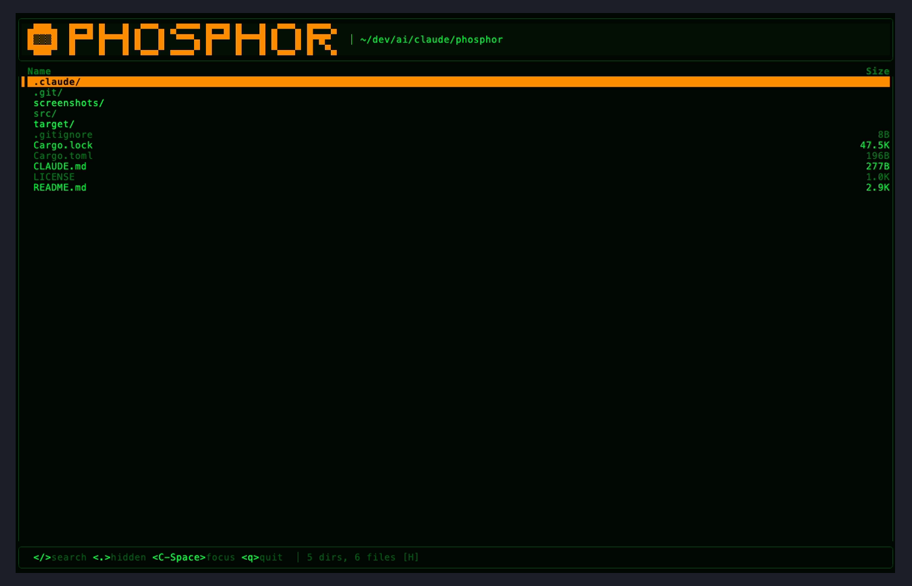
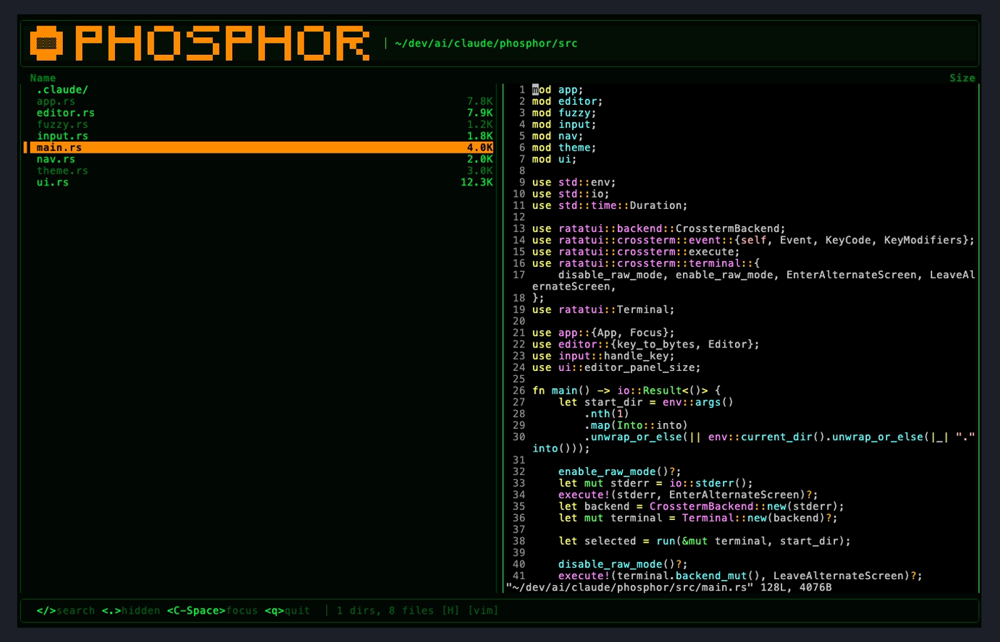

# phosphor

A keyboard-driven terminal directory browser with fuzzy search, written in Rust.

Navigates directories and integrates with your shell's `cd` — select a directory and your shell changes to it. Opens files directly in an embedded vim pane.



## Features

- vim-style key bindings (`hjkl`, `g`/`G`)
- Real-time fuzzy search with `nucleo`
- Shows hidden files by default (toggle with `.`)
- Opens files in an embedded vim pane (`l` or `Enter` on a file) — you can keep navigating on the left while editing on the right
- Toggle focus between the browser and vim with `Ctrl-Space`
- Shell `cd` integration — select a directory to change to it
- Phosphor-green CRT colour scheme with an orange selection band

## Split-pane editing

Selecting a file no longer leaves the browser. phosphor spawns vim inside a pseudo-terminal and renders it into the right pane while the left pane stays fully navigable.



## Installation

Requires Rust (stable). Install via [rustup](https://rustup.rs/).

```bash
cargo install --path .
```

Or build without installing:

```bash
cargo build --release
# binary at ./target/release/phosphor
```

## Shell integration

Add a wrapper function to your shell config so selecting a directory automatically changes to it.

**bash** (`~/.bashrc`):
```bash
p() {
  local dir
  dir=$(phosphor "$@") && [[ -n "$dir" ]] && cd "$dir"
}
```

**zsh** (`~/.zshrc`):
```zsh
p() {
  local dir
  dir=$(phosphor "$@") && [[ -n "$dir" ]] && cd "$dir"
}
```

**fish** (`~/.config/fish/config.fish`):
```fish
function p
  set dir (phosphor $argv)
  and test -n "$dir"
  and cd $dir
end
```

Then run `p` (or `p /some/path`) from your terminal.

## Key bindings

### Normal mode

| Key | Action |
|-----|--------|
| `j` / `↓` | Move down |
| `k` / `↑` | Move up |
| `l` / `→` / `Enter` | Enter directory / open file in the right-pane vim |
| `h` / `←` / `Backspace` | Go to parent directory |
| `~` | Go to home directory |
| `g` | Jump to top |
| `G` | Jump to bottom |
| `.` | Toggle hidden files |
| `/` | Enter search mode |
| `Ctrl-Space` | Toggle focus between browser and vim pane |
| `Enter` (on directory) | Select directory and exit (triggers shell `cd`) |
| `q` / `Ctrl-C` | Quit without changing directory |

When the right pane is focused, all keys are forwarded to vim. Press `Ctrl-Space` to return focus to the browser, or `:q` in vim to close the pane entirely.

### Search mode

| Key | Action |
|-----|--------|
| Any character | Append to search query |
| `Backspace` | Delete last character |
| `↑` / `↓` | Navigate filtered results |
| `Enter` | Confirm search, return to normal mode |
| `Esc` | Cancel search and clear filter |

## Dependencies

- [ratatui](https://github.com/ratatui/ratatui) — terminal UI framework
- [nucleo-matcher](https://github.com/helix-editor/nucleo) — fuzzy matching
- [portable-pty](https://github.com/wez/wezterm/tree/main/pty) — pseudo-terminal hosting the embedded vim
- [vt100](https://github.com/doy/vt100-rust) — VT100/ANSI parser for the vim pane
- [dirs](https://github.com/dirs-dev/dirs-rs) — home directory lookup
- [walkdir](https://github.com/BurntSushi/walkdir) — directory traversal

## Licence

MIT — see [LICENSE](LICENSE).
